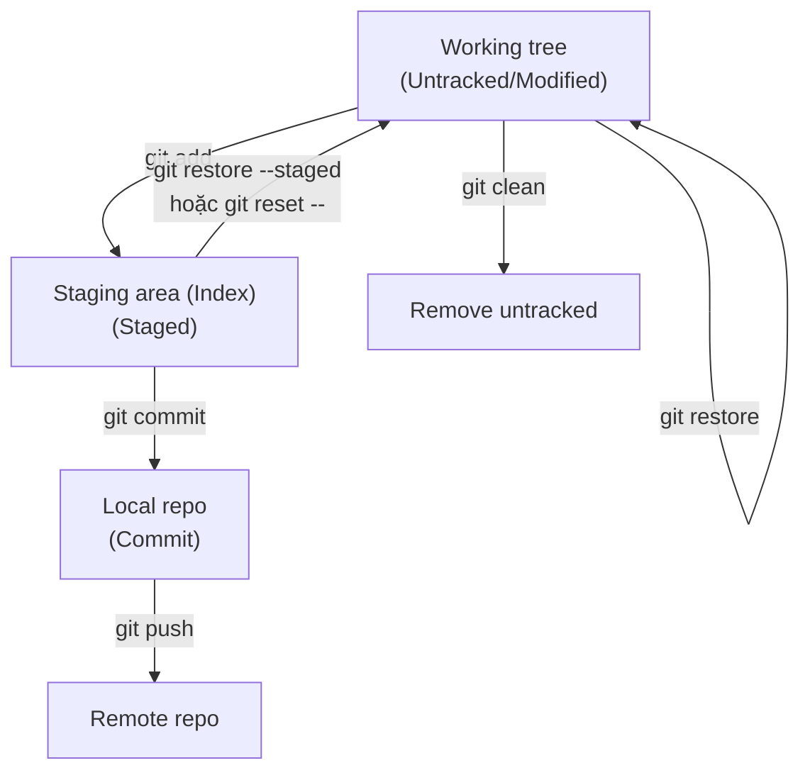
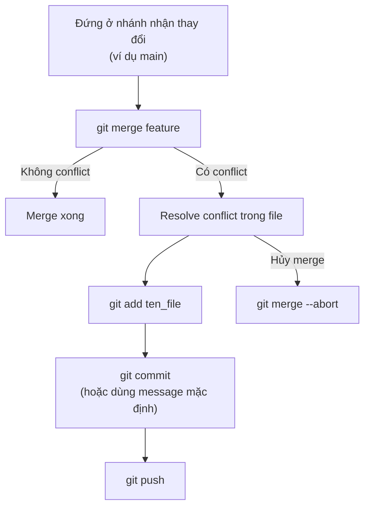

# Ghi chú Git (tái cấu trúc)

Luồng học hợp lý:
**File → Commit → Branch → Repository/Remote → Config/Quyền truy cập**

---

## Sơ đồ (Mermaid)

### Luồng thay đổi: Working tree → Staging → Commit → Remote



### Luồng merge khi có conflict



## 1) Làm việc với file (Working tree + Index)

### 1.1 Trạng thái file (git status)

- **Untracked**: file mới, Git chưa theo dõi.
- **Modified (unstaged)**: file đã được theo dõi và có thay đổi, nhưng chưa add vào vùng stage.
- **Staged**: thay đổi đã được add vào vùng stage (sẵn sàng commit).

Kiểm tra trạng thái:

```bash
git status
```

### 1.2 Thêm/loại khỏi staged

Thêm vào staged:

```bash
git add <ten_file>
git add .
```

Bỏ staged (giữ thay đổi trong working tree):

```bash
git restore --staged <ten_file>
git restore --staged .
```

Hoặc dùng `reset` (chỉ tác động staging area/index, không làm mất thay đổi trong file):

```bash
git reset -- <ten_file>
git reset -- .
```

### 1.3 Ngừng theo dõi file (nhưng không xóa file trong máy)

```bash
git rm --cached <ten_file>
git rm --cached .
```

### 1.4 Đổi tên file (để Git hiểu là rename)

```bash
git mv <oldName> <newName>
```

---

## 2) Commit

### 2.1 Tạo commit

```bash
git commit -m "message"
```

### 2.2 Sửa commit gần nhất (message hoặc nội dung)

```bash
git commit --amend -m "new message"
```

Nếu muốn amend nội dung: hãy stage thay đổi trước rồi mới amend.

### 2.3 Xóa commit gần nhất (cẩn thận)

- **Giữ thay đổi, chỉ bỏ commit**:

```bash
git reset --soft HEAD~1
```

- **Bỏ commit + bỏ luôn thay đổi**:

```bash
git reset --hard HEAD~1
```

Nếu commit đã được push lên remote: thường phải `reset` rồi `push --force` (rất dễ ảnh hưởng người khác). Chỉ dùng khi bạn hiểu hậu quả và repo cho phép.
Thường nên ưu tiên `--force-with-lease` thay vì `--force`.

### 2.4 Hủy thay đổi (restore/clean)

Hủy thay đổi ở file đã theo dõi (so với commit gần nhất):

```bash
git restore <ten_file>
git restore .
```

Hủy staged (đưa từ staged về modified/unstaged):

```bash
git restore --staged <ten_file>
git restore --staged .
```

Xóa file/thư mục untracked:

```bash
git clean -n
git clean -f
git clean -fd
```

### 2.5 Lấy lại file từ commit cũ (không chuyển branch)

Khuyến nghị (cú pháp mới):

```bash
git restore --source <maCommit> -- <ten_file>
```

Tương đương (cú pháp cũ):

```bash
git checkout <maCommit> -- <ten_file>
```

---

## 3) Kiểm tra thay đổi & lịch sử

So sánh working tree với staged (hoặc với commit gần nhất nếu chưa staged):

```bash
git diff
```

So sánh staged với commit hiện tại:

```bash
git diff --staged
git diff --staged <ten_file>
```

So sánh 2 commit:

```bash
git diff <maCommit1> <maCommit2>
```

Xem lịch sử:

```bash
git log --oneline
git log --oneline --graph
```

---

## 4) Bỏ qua theo dõi (.gitignore)

Tạo file `.gitignore`, ví dụ:

```gitignore
# Visual Studio Code
.vscode/

# Temp files
*.tmp

# Ignore a folder
folderName/
path/folderName/

# Bin hoặc bin
[Bb]in/
```

---

## 5) Stash (lưu tạm thay đổi)

```bash
git stash
git stash apply
git stash pop
git stash clear
```

---

## 6) Branch

### 6.1 Tạo/chuyển/xóa/đổi tên

Tạo branch:

```bash
git branch <newBranch>
```

Tạo và chuyển sang branch:

```bash
git checkout -b <branchName>
```

Chuyển branch:

```bash
git checkout <branchName>
```

Nếu Git version mới, có thể dùng:

```bash
git switch -c <branchName>
git switch <branchName>
```

Xóa branch:

```bash
git branch -d <branchName>
git branch -D <branchName>
```

Gợi ý:
- `-d`: chỉ xóa khi branch đã được merge
- `-D`: ép xóa

Đổi tên branch:

```bash
git branch -m <old_branch> <new_branch>
```

Kiểm tra branch:

```bash
git branch
git branch -a
```

### 6.2 Gộp nhánh (merge)

Đứng ở nhánh nhận thay đổi (ví dụ main/master), rồi merge nhánh còn lại:

```bash
git merge <ten_nhanh_can_gop>
```

Hủy merge đang dang dở (khi có conflict):

```bash
git merge --abort
```

Nếu `git merge --abort` không hoạt động (hiếm), có thể dùng:

```bash
git reset --merge
```

### 6.3 Xử lý conflict (gợi ý quy trình)

- Checkout nhánh đang bị conflict
- Đồng bộ nhánh chính/remote trước khi xử lý (thường là `git fetch` hoặc `git pull` tùy team)
- Mở file conflict, chọn phần đúng
- Add + commit + push

```bash
git add <file_chua_conflict>
git commit
git push
```

Nếu dùng mergetool:

```bash
git mergetool
```

---

## 7) Repository / Remote

Set upstream khi push lần đầu:

```bash
git push --set-upstream origin <branchName>
```

Đổi URL remote:

```bash
git remote set-url origin <new_url>
```

Đổi tên remote:

```bash
git remote rename <oldName> <newName>
```

Xóa branch trên server:

```bash
git push origin --delete <branchName>
```

Tăng giới hạn dữ liệu push (khi push file lớn bị lỗi):

```bash
git config http.postBuffer 524288000
```

---

## 8) Submodule

Thêm submodule:

```bash
git submodule add <url> <path>
git add .gitmodules <path>
```

Lệnh hay dùng:

```bash
git submodule update --init --recursive
```

---

## 9) Config & Quyền truy cập

Xem config:

```bash
git config --list
```

Thiết lập user global:

```bash
git config --global user.name "your_name"
git config --global user.email "your_email"
```

### 9.1 SSH (khuyến nghị)

Checklist:
- Cài OpenSSH Client
- Tạo key
- Copy public key lên Git provider
- Sửa `~/.ssh/config` nếu dùng nhiều key
- Đổi remote sang dạng SSH

Tạo key (ví dụ):

```bash
ssh-keygen -t ed25519 -C "your_email" -f ~/.ssh/id_ed25519_yourname
```

Xem public key để copy:

```bash
cat ~/.ssh/id_ed25519_yourname.pub
```

### 9.2 HTTPS (PAT thay mật khẩu)

- Có thể nhập username/password thủ công mỗi lần (không khuyến nghị)
- Dùng Personal Access Token (PAT) thay mật khẩu
- Nếu muốn lưu credential:

```bash
git config --global credential.helper store
```

Lưu ý: `credential.helper store` thường lưu dạng plaintext trong máy.

---

## 10) Bài tập mỗi ngày (gợi ý)

- Kiểm tra remote, đổi tên remote, đổi remote URL
- Clone/pull/push với repo
- Tạo/đổi/xóa branch (local + remote)
- Set upstream khi push branch mới
- Thử conflict nhỏ và tự resolve
- Thiết lập SSH và test kết nối
